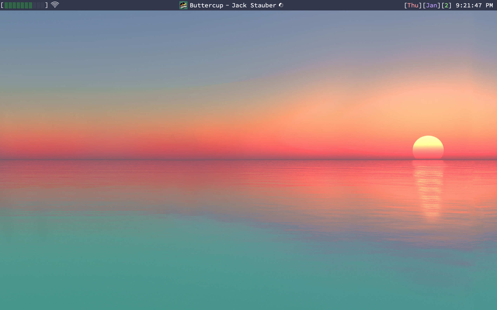
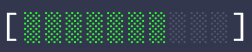
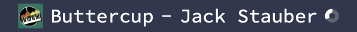
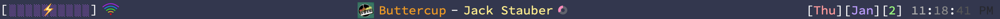
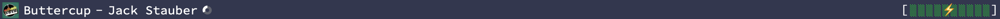

# MyBar - Menubar for Mac

MyBar is a custom menubar for OSX. It has some basic customization to configure it to your liking. The reason for its creation was to develop a widget of my own and learn the basics of React.

This project should also help others get started as I tried to document as much as I could.




## Features

### Battery Display 

A custom text-display representing battery life.

Displays alerts for when the computer is near dead or charging. Change the icons to whatever you want or disable them altogether. 

### Spotify Integration 

Displays the current song playing in the Spotify app, as well as some other info (including album art and the time left). The order of these components is customizeable, as is the time remaining icon. 

### And More!

You can also display:

* Wifi (optionally with SSID)
* Time and Date
* The current application

### Colors!

Make your menu shine bright with customizeable colors!



### Shake It Up

Change the order of the widgets to your liking with a simple string:

```javascript
export const renderOrder = 'S-B';
```



```javascript
export const renderOrder = '-B-';
```


Or whatever you want! You can also place the bar at the bottom of your screen.


## Installation

Download and install Übersicht from their website: [http://tracesof.net/uebersicht/](http://tracesof.net/uebersicht/).

Then simply clone this repository into your Übersicht widgets folder.

```shell
git clone https://github.com/MrGVSV/mybar.git ~/Library/Application\ Support/Übersicht/widgets/mybar/
```

(Also be sure to set Automatically Hide and Show the Menu Bar in Preferences > General if you want to "replace" it.)


## Customization

You can do some basic customizations in the config.js file in the src folder. There is a lot of documentation there so feel free to play around. Or just dig into the files and come up with something of your own.


## Enjoy!

Fork it, learn with it, do whatever with it. Just remember to have fun!

Also, big thanks to the [original](https://github.com/callahanrts/bar) which gave me inspiration to create my own!
